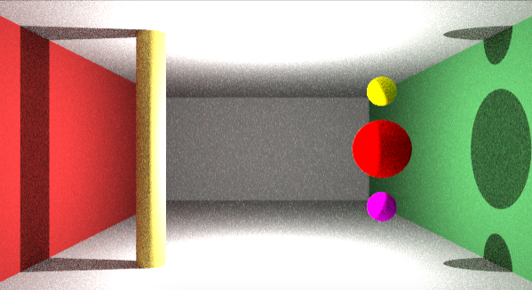
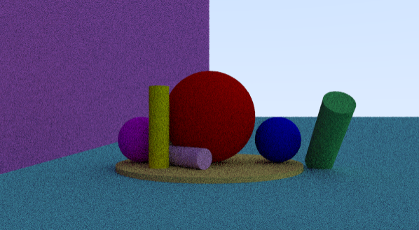
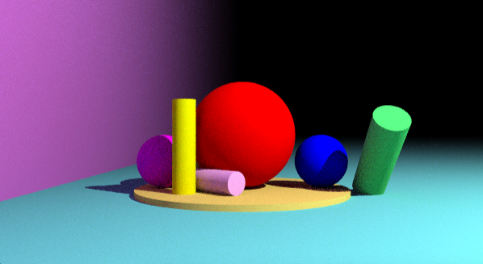
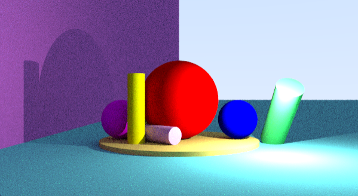
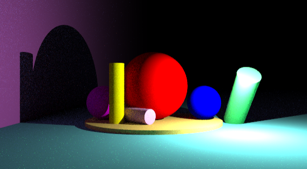

# miniRT
MiniRT 42 Core
A minimal raytracing program wrote in C and MiniLibX.<br><br>


## Installation
The scene must be correctly formatted.<br>
This project is using the ``Minilibx`` using the Metal framework and therefore should work only on macOS<br>

1. Clone the repo:
```
git clone https://github.com/sergii-moroz/minirt.git
```
2. `cd` into it and run `make` to compile it:
```
cd minirt
make
```
3. Now try some tests:
```
./miniRT ./scene/test00.rt
```

There are some scenes in the `scene` folder that showcase minirt.

## Definitions

Ambient lighting:	`A {ratio} {color}`
* Ambient lighting ratio in range [0.0,1.0].
* R,G,B colors in range [0-255].

Camera:	`C {position} {orientation} {FOV}`
* X,y,z coordinates of the view point.
* A vector with the the x,y,z axis in the range [-1,1].
* Horizontal field of view in degrees in range [0,180].

Light:	`L {position} {ratio} {color}`
* X,y,z coordinates of the light point.
* The light brightness ratio in range [0.0,1.0].
* R,G,B colors in range [0-255].

Sphere:	`sp {position} {diameter} {color}`
* X,y,z coordinates of the sphere center.
* The sphere diameter.
* R,G,B colors in range [0-255].

Plane:	`pl {position} {orientation} {color}`
* X,y,z coordinates.
* A vector with the the x,y,z axis in the range [-1,1].
* R,G,B colors in range [0-255].

Cylinder:	`cy {position} {orientation} {diameter} {height} {color}`
* X,y,z coordinates for the cylinder center.
* A vector with the the x,y,z axis in the range [-1,1].
* The cylinder diameter.
* The cylinder height.
* R,G,B colors in range [0-255].


### Images




